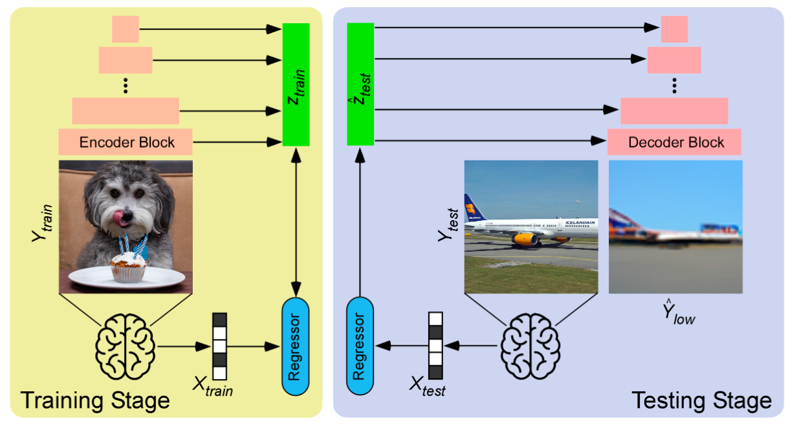
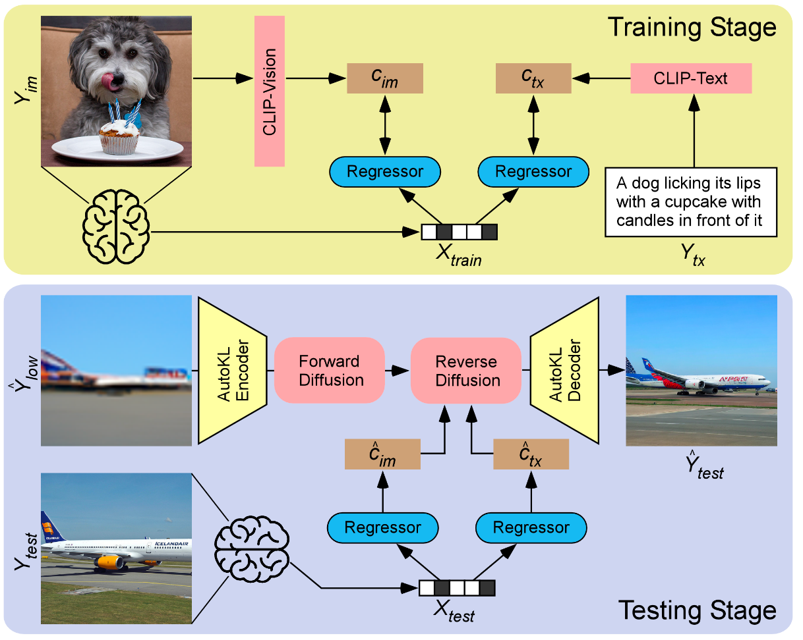

# Image Reconstruction Project

## 1. Background
### 1.1 Previous Works
Functional Magnetic Resonance Imaging (fMRI) has been a cornerstone in neuroimaging, offering insights into brain activity by detecting changes associated with blood flow. The application of deep learning techniques like Generative Adversarial Networks (GAN), Variational Autoencoders (VAE), and diffusion models has revolutionized image reconstruction, providing the means to visualize perceived images from brain activity. This project builds on these developments, attempting to harness the potent combination of fMRI data with state-of-the-art generative models learned in previous deep learning courses.

Prior efforts in this field have demonstrated varying degrees of success in reconstructing images from brain activity, using datasets curated primarily from visual stimuli presented to subjects during fMRI scans. Notably, techniques involving deep learning have shown promising results, which this project seeks to replicate and advance.

## 2. Main Question
Can the integration of fMRI data with deep learning models learned from previous DL courses improve the fidelity of reconstructed images?

## 3. Objectives
- Learn and analyze neuroimaging data and apply deep learning theories to fMRI data.
- Understand the Brain Diffuser and reproduce the output to learn about the latest advancements in image reconstruction.

## 4. Methods
### 4.1 Project Execution
Modified the Brain-Diffuser code from the [official GitHub repository](https://github.com/ozcelikfu/brain-diffuser) to be compatible with Apple Silicon (MPS) for enhanced performance.

### 4.2 Analysis Pipeline
#### Stage One: Basic Image Reconstruction

- **Training:**
  - **Input:**
    - Standardized fMRI patterns
    - Images viewed by the subjects

  - **Model Applied:** Very Deep Variational Autoencoder (VDVAE) Pretrained on ImageNet.
  - **Purpose:** Train a ridge regression model to map fMRI patterns ($X_{train}$) to latent variables ($Z_{train}$) generated by the VDVAE encoder. 

- **Testing:** The trained model predicts latent variables ($\hat{Z}_{test}$) from new fMRI data ($X_{test}$), which are then passed through the VDVAE decoder to reconstruct preliminary images ($\hat{Y}_{low}$), serving as initial guesses for the next stage.

#### Stage Two: Image Refinement

- **Training:**
  - **Input:**
    - Standardized fMRI patterns
    - Images viewed by the subjects
  - **Model Applied:** CLIP (Contrastive Language-Image Pre-training).
  - **Purpose:** Train two ridge regression models to map fMRI patterns ($X_{train}$) to CLIP-Vision ($c_{im}$) and CLIP-Text (${c}_{tx}$) features. These features guide the Versatile Diffusion model during the reverse diffusion process.
- **Testing:**
  - **Input:** 
    - Preliminary reconstructed images from Stage One.
    - New Standardized fMRI patterns
  - **Purpose:** In the image-to-image pipeline:
    - Encode the preliminary images with the AutoKL Encoder.
    - Introduce noise to the latent vectors through 37 steps of forward diffusion
    - The predicted CLIP-Vision ($\hat{c}_{im}$) and CLIP-Text ($\hat{c}_{tx}$) features is used to guide the reverse diffusion.
    - The resulting denoised latent vectors are processed through the AutoKL Decoder to produce the final reconstructed image ($\hat{Y}_{test}$).

## 5. Dataset
Utilized a subset of the Natural Scenes Dataset (NSD), specifically from subject one (sub01). Data were downloaded from AWS using the 'aws a3' method, covering directories like `natural-scenes-dataset/nsddata`, `natural-scenes-dataset/nsddata_stimuli`, and `nsddata_betas/ppdata/subj01/func1pt8mm`.

The NSD provides a more complex and varied visual dataset than the Kamitani dataset, which is crucial for testing the model’s ability to handle and reconstruct intricate natural scenes effectively.

## 6. Tools
- **PyTorch**: Essential for constructing and training the VDVAE and Versatile Diffusion models for image reconstruction.
- **nilearn**: Facilitates statistical learning and analysis of neuroimaging data.
- **SciPy, NumPy, Pandas**: Provide mathematical functions necessary for data processing and transformation.
- **GitHub**: Hosts and versions the project code, facilitating collaboration and code sharing.
- **Computing Environment**: MacBook Pro with an Apple Silicon chip (M1 Pro) .

## 7. Results
The results of this project did not meet the initial expectations. Both stages of the image reconstruction process were completed successfully, yet the outputs were less than ideal:

- **Stage One Output**: The reconstructed images from this stage were abstract and lacked detailed representation of the original scenes viewed by the subjects. The images contained only basic shapes and color distributions.

- **Stage Two Output**: Despite employing the Versatile Diffusion model to refine the images further, the final outputs remained abstract. The refined images did not capture the realism or detail of the natural scenes, and they were not visually recognizable as the intended subjects.

## 8. Deliverables
- **README**: This markdown file provides comprehensive documentation of the project's background, methods, results, and conclusions.
- **`results/` Folder**: Contains the outputs from replicating the Brain Diffuser method, showcasing the stages of image reconstruction from fMRI data.
- **Jupyter Notebooks (.ipynb)**: A collection of notebooks presenting the homework completed during various modules at Brainhack, demonstrating the application of learned concepts to practical tasks.

## 9. Conclusion
### 9.1 Achievements
- Successfully understood and replicated the Brain Diffuser's method for implementing image reconstruction from fMRI data. 
- Effectively integrated neuroimaging knowledge acquired at Brainhack with deep learning techniques to apply theoretical insights into practical fMRI data analysis. 

### 9.2 Challenges
The primary challenge was the model's failure to produce realistic and detailed visual representations from the fMRI data, as shown by superior reconstructions in published studies. The abstract nature of the output images suggests that further examination and modification in training processes are necessary.

### 9.3 Learned Skills
- **Neuroimaging**: As a master's graduate in quantitative economics and a current Computer Science master's student, I had minimal exposure to fMRI data before attending Brainhack. My understanding was limited to self-study through online courses. During Brainhack, I focused on modules related to fMRI data, progressively understanding the data generation principles and processing workflows through extensive literature review and assignment completion. This project and the courses at Brainhack have provided me with a foundational understanding of how to utilize fMRI data and sparked a strong desire to continue exploring this field further.
- **Deep Learning Models**: Although my academic background in Computer Science provided me with theoretical knowledge of various models such as GANs, VAEs, and stable diffusion, there was a significant gap between theoretical understanding and practical application, particularly in applying these models to tasks beyond traditional image datasets. Before this project, I had no practical experience with using these models for fMRI-based image reconstruction. Through this project, I bridged this gap by implementing these models, guided by both academic knowledge and innovative approaches explored through various GitHub repositories. This experience has greatly enhanced my understanding of code and debugging, providing a practical perspective on applying deep learning models to neuroimaging data.

### 9.4 Next Steps
Future work will focus on two main areas to improve image fidelity: first, a thorough review and debugging of the current code and logic to identify errors; second, exploring alternative modeling approaches, potentially incorporating newer or more complex neural network architectures to refine the accuracy and realism of reconstructed images.

## 10. References
- https://arxiv.org/abs/2303.05334
- https://mind-vis.github.io/
- https://medarc-ai.github.io/mindeye/
- https://www.biorxiv.org/content/10.1101/2022.11.18.517004v3

